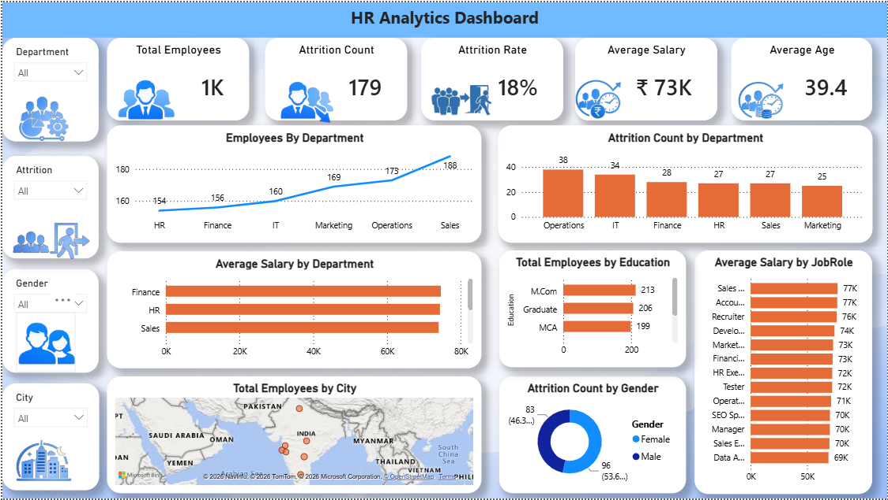

# HR Analytics Dashboard

An interactive HR Analytics Dashboard developed using Power BI to analyze employee attrition, salary, demographics, departments, job roles, and workforce trends.

## Tools Used

- Power BI
- Power Query
- DAX
- Excel

## Dashboard KPIs

- Total Employees
- Attrition Count
- Attrition Rate
- Average Salary
- Average Age

## Analysis

- Employees by Department
- Attrition Count by Department
- Average Salary by Department
- Total Employees by Education
- Average Salary by Job Role
- Total Employees by City
- Attrition Count by Gender

## Dashboard Preview

